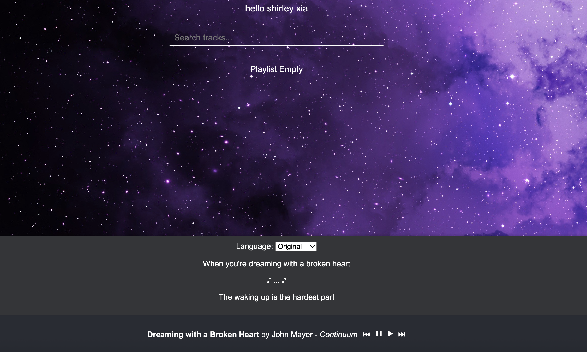

Have you ever listened to a korean song on spotify and wish you knew what they were singing about, but the lyrics are in korean? well, spotify translate will give you the option to view the lyrics and translate it. simply login to the app with your spotify account, and it will display for you the lyrics of the song you are listening to and give you the option to translate it into english, or any language you want.

tldr:
this is a spotify extension that will allow users to view and translate lyrics of popular foreign language songs into the language of their choice--written in reactJS

todo: mobile version of this app, currently only for web

